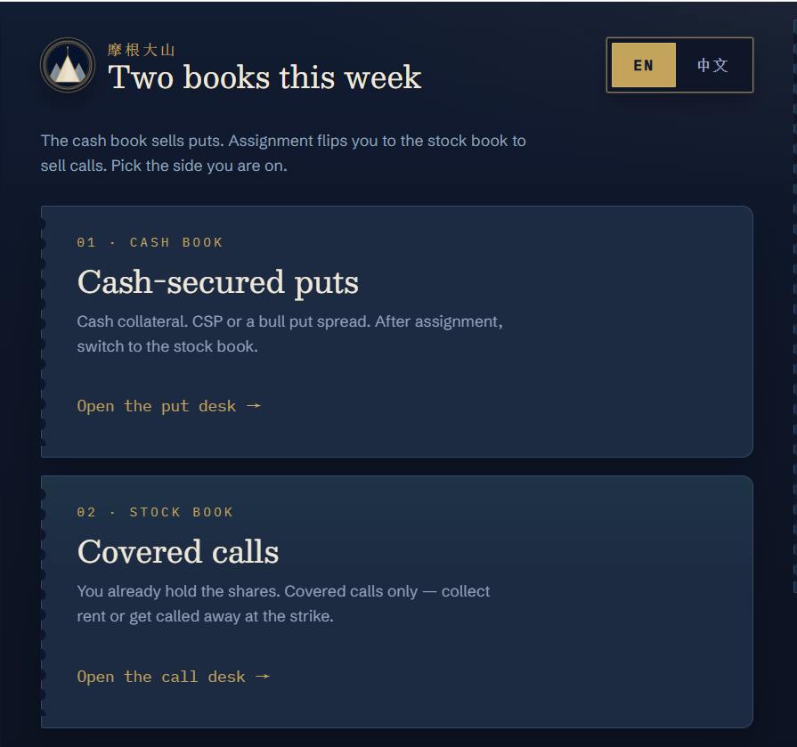
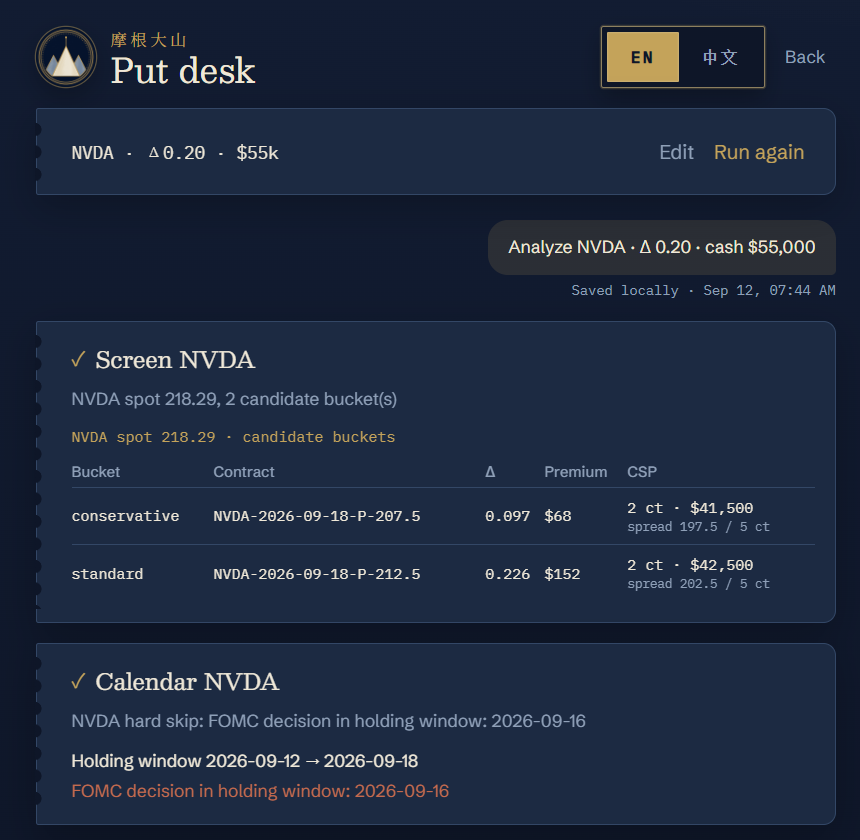
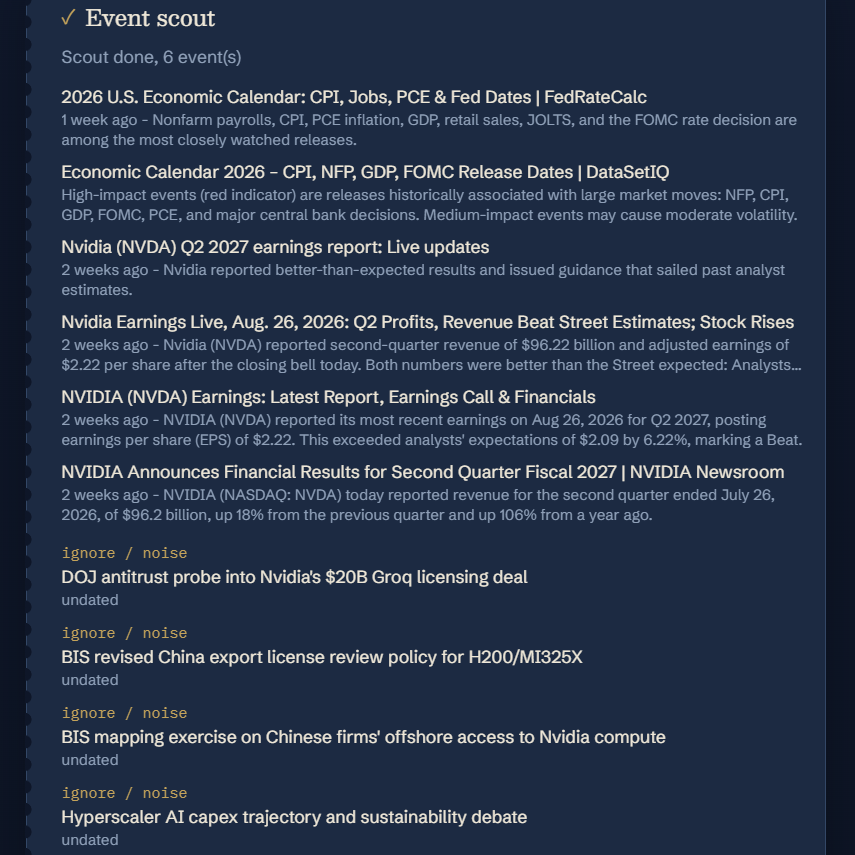
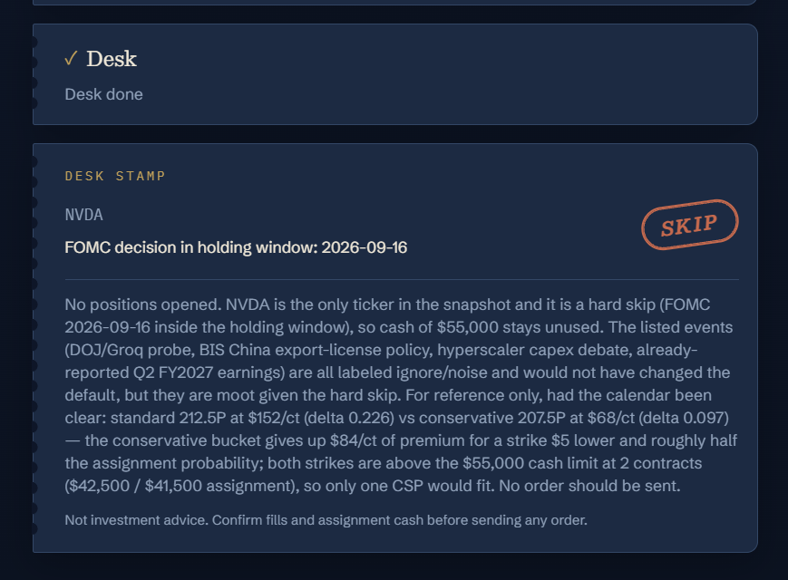

# Option Desk

A short-dated US-equity **wheel desk**. It recommends. It does not send orders. Try it at [https://option.xdashan.top/](https://option.xdashan.top/).

[中文说明](README.zh-CN.md)

Pick a book: cash-secured puts, or covered calls on shares you already hold. Both books share one pipeline: screen the chain → calendar gate → event scout → structured desk. DTE 3–9 days.

- **Cash-secured puts**: cash-secured put or bull put spread
- **Covered calls**: covered calls only (no call spreads). Contracts = shares `// 100`. Cost basis is required so assignment can be judged against what you paid.

The CLI still runs puts only. The call book is Web-only.

> **Not investment advice. Not automated trading.** Output is for a human to review. Options can lose the entire premium. A CSP assignment needs cash on hand; a covered-call assignment sells the shares at the strike.

## What it does

- Pulls a **live option chain** from yfinance and **estimates** put / call Delta with chain IV + Black-Scholes (not exchange Greeks)
- Screens two buckets: `conservative` (~0.10Δ) and `standard` (~0.20Δ). `0.2Δ` is the default anchor, not a hard wall. On calls, conservative is further OTM (higher strike)
- Compares ATM IV with 20/60/120-day realized vol (not a stored IV percentile), 1-sigma expected move vs strike distance, and a 0–100 contract score
- VIX + SPY/QQQ regime is a **reduce** signal (prefer conservative). It never hard-SKIPs on its own
- Earnings or FOMC in the holding window → **hard SKIP** (you may not keep selling at a smaller Delta)
- CPI / NFP / PCE are soft tags for the desk
- The LLM searches fixed queries for off-calendar gaps (export controls, capex, lawsuits, …)
- The desk may only emit `SKIP | OPEN` plus structure plus bucket plus a **`contract_id` already in that bucket**
  - Puts: `CSP | BULL_PUT_SPREAD`
  - Calls: `COVERED_CALL`
- Runs without an API key: event classification and the desk fall back to heuristics
- The Web desk streams progress over SSE. Docker Compose ships one container.

Changing the Delta anchor on the Web scales the conservative bucket by `0.11 / 0.20`.

## UI

Open the desk and pick a book: cash-secured puts, or covered calls.



The desk screens the chain and shows `conservative` / `standard` candidates (put book below).



The calendar gate checks earnings / FOMC / macro dates in the holding window. Event scout then looks for off-calendar gaps.



The desk stamps only `SKIP` or `OPEN`. OPEN includes an expiration P/L chart.



First visit picks Chinese for a mainland China IP and English otherwise. The in-page **EN / 中文** switch is saved in the browser and wins after that. Each analysis sends the current language, so progress lines, warnings, and LLM prose match.

## Requirements

- Python ≥ 3.11
- Node.js 20+ if you split frontend and API locally
- Optional LLM: DeepSeek, OpenAI, or any OpenAI-compatible endpoint

## Install

```bash
git clone https://github.com/lds051332/OptionTradingAgent.git
cd OptionTradingAgent
python -m venv .venv
```

Windows:

```bash
.venv\Scripts\activate
pip install -e ".[dev]"
copy .env.example .env
```

macOS / Linux:

```bash
source .venv/bin/activate
pip install -e ".[dev]"
cp .env.example .env
```

The app **only reads `.env`**, never `.env.example`. Put LLM keys in `.env`.

## Configure the LLM

Default is DeepSeek:

```
OPTION_DESK_LLM_PROVIDER=deepseek
OPTION_DESK_MODEL=deepseek-chat
DEEPSEEK_API_KEY=sk-...
```

Any OpenAI-compatible endpoint:

```
OPTION_DESK_LLM_PROVIDER=openai_compatible
OPTION_DESK_BACKEND_URL=https://your-relay.example/v1
OPTION_DESK_MODEL=your-model-id
OPTION_DESK_API_KEY=...
```

With `OPTION_DESK_LLM_PROVIDER=auto`: `DEEPSEEK_API_KEY` selects DeepSeek, `OPENAI_API_KEY` selects OpenAI, and `OPTION_DESK_BACKEND_URL` selects the compatible endpoint.

Optional `TAVILY_API_KEY` usually beats the default DuckDuckGo search.

## CLI

```bash
python -m option_desk analyze
python -m option_desk analyze --tickers NVDA --as-of 2026-09-02
python -m option_desk analyze --tickers NVDA --lang zh
option-desk analyze --tickers NVDA,MSFT
```

`--lang zh` switches terminal headers, the markdown report, and LLM titles/reasons to Simplified Chinese. Enums (`OPEN`, `BULL_PUT_SPREAD`, `COVERED_CALL`, `spread_only`), tickers, `contract_id`, and numbers stay as-is. You can also set `OPTION_DESK_OUTPUT_LANGUAGE=zh` in `.env`.

The terminal prints buckets, the calendar gate, events, and the desk decision, and writes markdown to `~/.option_desk/reports/`.

`--as-of` only shifts DTE and calendar windows. The chain is always a **live** yfinance snapshot.

## Web (local)

One command from the repo root starts or restarts the desk (and stops whatever already holds the port):

Windows (double-click `desk.cmd`, or run it in PowerShell):

```powershell
.\desk.cmd
.\desk.cmd -Dev          # API + Vite HMR
.\desk.cmd -Stop         # stop only
.\desk.cmd -Build        # force a frontend rebuild
.\desk.cmd -NoBuild      # skip build when dist already exists
```

macOS / Linux:

```bash
chmod +x scripts/desk.sh
./scripts/desk.sh
./scripts/desk.sh --dev
./scripts/desk.sh --stop
```

Default URL: `http://127.0.0.1:8000`. You land on the two-book gate (puts / calls); the run unfolds step by step. The script handles an existing process, a missing `.venv`, missing deps, a missing `.env`, and a stale or missing frontend `dist`.

Or run two terminals yourself:

```bash
python -m option_desk.web
cd web && npm install && npm run dev
```

## Web (cloud Linux)

```bash
git clone https://github.com/lds051332/OptionTradingAgent.git
cd OptionTradingAgent
cp .env.example .env
# edit .env: DEEPSEEK_API_KEY
docker compose up -d --build
```

Default publish port is `8000`. If Nginx terminates HTTPS in front, turn off buffering for SSE:

```nginx
location / {
    proxy_pass http://127.0.0.1:8000;
    proxy_http_version 1.1;
    proxy_set_header Host $host;
    proxy_set_header X-Real-IP $remote_addr;
    proxy_set_header X-Forwarded-For $proxy_add_x_forwarded_for;
    proxy_set_header X-Forwarded-Proto $scheme;
    proxy_buffering off;
    proxy_read_timeout 300s;
}

location /api/runs {
    proxy_pass http://127.0.0.1:8000;
    proxy_http_version 1.1;
    proxy_buffering off;
    proxy_cache off;
    proxy_read_timeout 300s;
}
```

## Pipeline

1. Read VIX / SPY / QQQ market regime (reduce, not a hard skip)
2. Screen the chain, estimate Delta, pick two buckets (put or call chain, per book)
3. Attach IV vs realized vol, expected move, and a contract score
4. Earnings or FOMC in the holding window → hard SKIP
5. CPI / NFP / PCE as soft tags
6. LLM searches fixed queries for off-calendar gaps
7. Desk emits action + structure + bucket + a **`contract_id` from that bucket**
8. OPEN includes expiration P/L: puts as a short option; calls as stock vs cost basis plus the short call

The CLI uses `run_desk()` (puts). The Web uses `iter_desk()` on the same path, with `desk_mode=put|call`, and streams SSE. Do not reimplement the screener.

```python
from datetime import date
from option_desk.config import Settings
from option_desk.pipeline import run_desk

run = run_desk(["NVDA"], as_of=date.today(), settings=Settings())
print(run.desk.decisions)
```

## Tests

```bash
pytest
```

## Layout

```
option_desk/          Python package: screener, calendar, scout, desk, CLI, FastAPI
  chain/              Option chain, Delta, IV vs HV, expected move, market regime
  calendar/           Earnings / FOMC / CPI / NFP / PCE gates
  events/             Search + LLM event classification
  agents/             Structured desk
  web/                FastAPI (SSE)
web/                  Vite + React desk
screenshots/          Web screenshots for this README
tests/
Dockerfile            Build the frontend, then serve static files from uvicorn
docker-compose.yml
```

## Explicitly out of scope

- Broker orders, position sync, intraday monitoring
- Historical IV percentile store or a market-wide scanner
- Multi-user accounts / OAuth, persisted chat history
- Aggressive (>0.25Δ) buckets, call spreads, index / crypto options
- CLI covered calls (the call book is Web-only)

TradingAgents is a structural reference only. This package does not depend on it.
