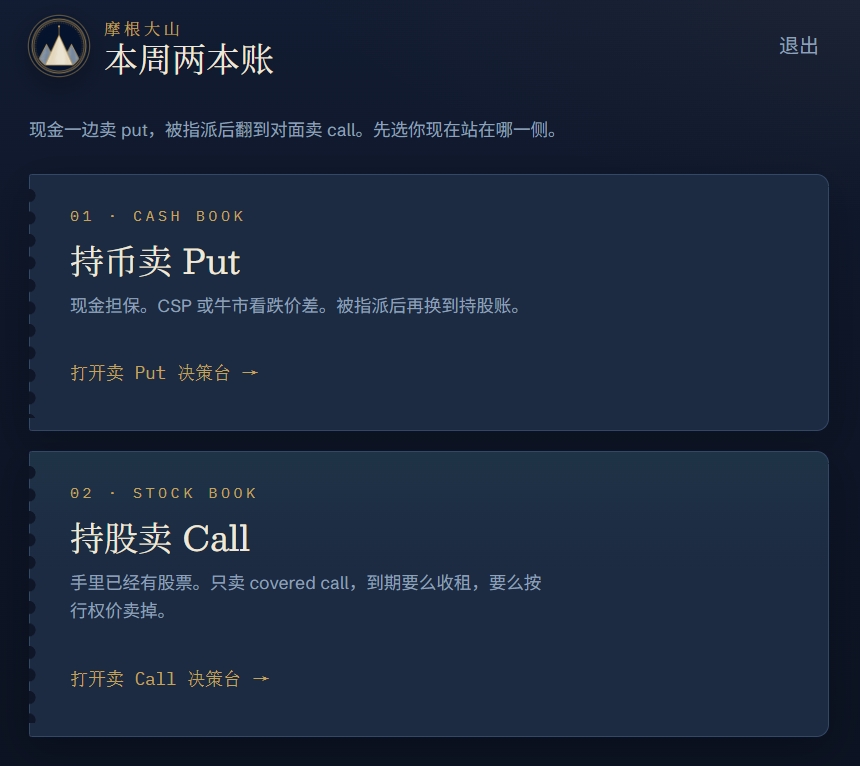
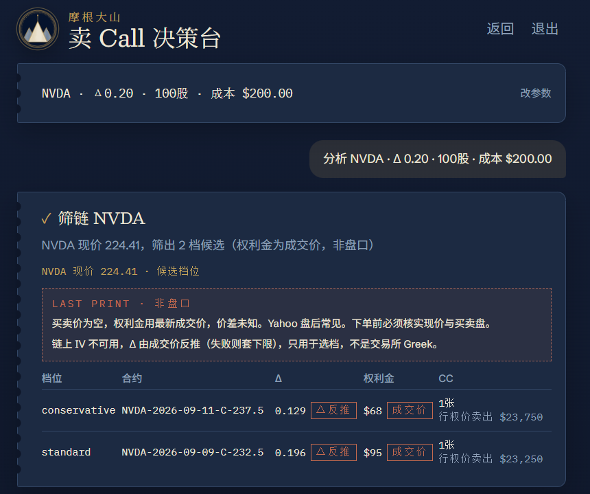
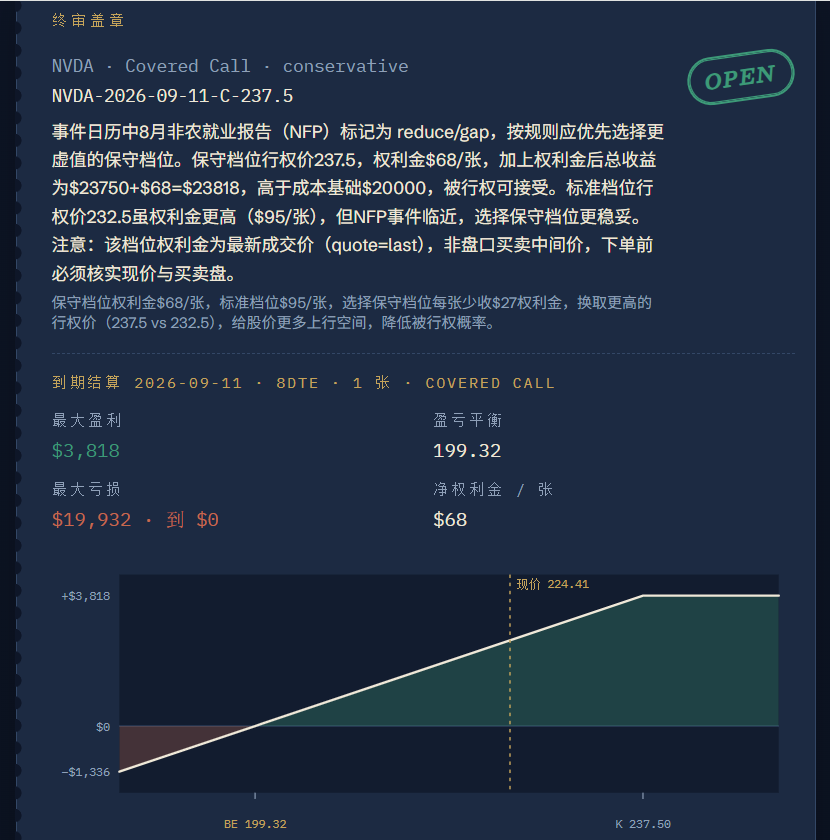

# Option Desk

美股个股、短周期**轮式决策台**。给建议，不报单。欢迎到 [https://option.xdashan.top/](https://option.xdashan.top/) 体验，口令 `677729`。

登录后先选账本：持币卖 put，或持股卖 covered call。两条账共用同一条流水线：拉链 → 日历门控 → 事件侦察 → 结构化终审。DTE 3–9 天。

- **持币卖 Put**：Cash-secured Put 或 Bull Put Spread
- **持股卖 Call**：只卖 Covered Call（不做看涨价差）。张数 = 持股 `// 100`，并填成本价，用来判断被指派是否划算

CLI 目前仍只跑卖 Put；Call 账只在 Web 里。

> **不是投资建议，也不是自动交易。** 输出只给人工复核。期权可能亏掉全部权利金。CSP 被指派时要准备现金；covered call 被指派即按行权价卖掉持股。

## 做什么

- 从 yfinance 拉**实时期权链**，用链上 IV + Black-Scholes **估算** Put / Call Delta（不是交易所官方 Greek）
- 筛出 `conservative`（约 0.10Δ）和 `standard`（约 0.20Δ）两档候选；`0.2Δ` 是默认锚，不是死门。卖 call 时保守档更虚值（更高行权价）
- 持有期内撞上财报或 FOMC → **硬 SKIP**（不许改成更小 Delta 继续卖）
- CPI / NFP / PCE 作为软标签交给终审
- LLM 按固定 query 搜日历外突发（出口管制、capex、诉讼等）
- 终审只许输出 `SKIP | OPEN` + 结构 + 档位 + **档位里已有的 `contract_id`**
  - Put：`CSP | BULL_PUT_SPREAD`
  - Call：`COVERED_CALL`
- 没有 API key 也能跑：事件分类和终审改用启发式规则
- Web 决策台用 SSE 逐步推进度；Docker Compose 一容器部署

Web 上改 Delta 锚时，保守档按 `0.11 / 0.20` 比例缩放。

## 界面

登录后先选账本：持币卖 put，或持股卖 covered call。



决策台先筛链，给出 `conservative` / `standard` 两档候选（下图为卖 Call）。



日历门控看持有期内的财报 / FOMC / 宏观日，事件侦察再扫日历外突发。


终审只盖 `SKIP` 或 `OPEN`，OPEN 时附到期损益图。



## 要求

- Python ≥ 3.11
- 本机前后端分开开发时还需要 Node.js 20+
- LLM 可选：DeepSeek、OpenAI，或任意 OpenAI 兼容接口

## 安装

```bash
git clone https://github.com/lds051332/OptionTradingAgent.git
cd OptionTradingAgent
python -m venv .venv
```

Windows：

```bash
.venv\Scripts\activate
pip install -e ".[dev]"
copy .env.example .env
```

macOS / Linux：

```bash
source .venv/bin/activate
pip install -e ".[dev]"
cp .env.example .env
```

程序**只读 `.env`**，不读 `.env.example`。把 key 和 Web 口令写进 `.env`。

## 配置 LLM

默认按 DeepSeek：

```
OPTION_DESK_LLM_PROVIDER=deepseek
OPTION_DESK_MODEL=deepseek-chat
DEEPSEEK_API_KEY=sk-...
```

任意 OpenAI 兼容接口：

```
OPTION_DESK_LLM_PROVIDER=openai_compatible
OPTION_DESK_BACKEND_URL=https://your-relay.example/v1
OPTION_DESK_MODEL=your-model-id
OPTION_DESK_API_KEY=...
```

`OPTION_DESK_LLM_PROVIDER=auto` 时：有 `DEEPSEEK_API_KEY` 走 DeepSeek，有 `OPENAI_API_KEY` 走 OpenAI，设了 `OPTION_DESK_BACKEND_URL` 则走兼容端点。

可选 `TAVILY_API_KEY`，搜索质量通常好过默认的 DuckDuckGo。

Web 还需要共享口令：

```
OPTION_DESK_WEB_PASSWORD=choose-a-password
OPTION_DESK_WEB_SECRET=random-long-string
```

## CLI

```bash
python -m option_desk analyze
python -m option_desk analyze --tickers NVDA --as-of 2026-09-02
python -m option_desk analyze --tickers NVDA --lang zh
option-desk analyze --tickers NVDA,MSFT
```

`--lang zh` 会把终端表头、markdown 报告、以及 LLM 写的标题/理由改成简体中文。枚举值（`OPEN`、`BULL_PUT_SPREAD`、`COVERED_CALL`、`spread_only`）、ticker、`contract_id` 和数字保持原样。也可以在 `.env` 里设 `OPTION_DESK_OUTPUT_LANGUAGE=zh`。

终端会打印档位、日历门控、事件和终审，同时写一份 markdown 到 `~/.option_desk/reports/`。

`--as-of` 只移动 DTE 和日历窗。期权链始终是 yfinance **实时快照**。

## Web（本机）

仓库根目录一键启动 / 重启（会先停掉占用端口的旧进程）：

Windows（可双击 `desk.cmd`，或在 PowerShell 里执行）：

```powershell
.\desk.cmd
.\desk.cmd -Dev          # API + Vite 热更新
.\desk.cmd -Stop         # 只停止
.\desk.cmd -Build        # 强制重构建前端
.\desk.cmd -NoBuild      # 有 dist 就不构建
```

macOS / Linux：

```bash
chmod +x scripts/desk.sh
./scripts/desk.sh
./scripts/desk.sh --dev
./scripts/desk.sh --stop
```

默认打开 `http://127.0.0.1:8000`。口令读 `.env` 的 `OPTION_DESK_WEB_PASSWORD`。登录后是两本账入口（持币卖 Put / 持股卖 Call），决策过程逐步摊开。脚本会处理：已有进程、缺 `.venv`、缺依赖、缺 `.env`、前端 `dist` 过期或缺失。

也可以手动开两个终端：

```bash
python -m option_desk.web
cd web && npm install && npm run dev
```

## Web（云 Linux）

```bash
git clone https://github.com/lds051332/OptionTradingAgent.git
cd OptionTradingAgent
cp .env.example .env
# 编辑 .env：DEEPSEEK_API_KEY、OPTION_DESK_WEB_PASSWORD、OPTION_DESK_WEB_SECRET
docker compose up -d --build
```

默认映射 `8000`。前面若有 Nginx HTTPS 反代，SSE 需要关掉缓冲：

```nginx
location / {
    proxy_pass http://127.0.0.1:8000;
    proxy_http_version 1.1;
    proxy_set_header Host $host;
    proxy_set_header X-Forwarded-For $proxy_add_x_forwarded_for;
    proxy_set_header X-Forwarded-Proto $scheme;
    proxy_buffering off;
    proxy_read_timeout 300s;
}

location /api/runs {
    proxy_pass http://127.0.0.1:8000;
    proxy_http_version 1.1;
    proxy_buffering off;
    proxy_cache off;
    proxy_read_timeout 300s;
}
```

HTTPS 时再设 `OPTION_DESK_WEB_SECURE_COOKIE=1`。

## 流水线

1. 拉链、估 Delta、筛两档合约（Put 链或 Call 链，由账本决定）
2. 持有期内遇财报或 FOMC → 硬 SKIP
3. CPI / NFP / PCE 作为软标签
4. LLM 按固定 query 搜日历外突发
5. 终审输出动作 + 结构 + 档位 + **档位里的 `contract_id`**
6. OPEN 时附到期损益：Put 按卖出权利；Call 按「股票相对成本价 + 卖 call」

CLI 走 `run_desk()`（卖 Put）；Web 走同一条路上的 `iter_desk()`，用 `desk_mode=put|call` 分账，逐步推 SSE。不要把筛子逻辑再写一遍。

```python
from datetime import date
from option_desk.config import Settings
from option_desk.pipeline import run_desk

run = run_desk(["NVDA"], as_of=date.today(), settings=Settings())
print(run.desk.decisions)
```

## 测试

```bash
pytest
```

## 目录

```
option_desk/          Python 包：筛子、日历、侦察、终审、CLI、FastAPI
  chain/              期权链 + Black-Scholes Delta
  calendar/           财报 / FOMC / CPI / NFP / PCE 门控
  events/             搜索 + LLM 事件分类
  agents/             结构化终审
  web/                FastAPI（口令登录、SSE）
web/                  Vite + React 决策台
screenshots/          Web 界面截图（README 用）
tests/
Dockerfile            先构建前端，再由 uvicorn 托管静态文件
docker-compose.yml
```

## 明确不做

- 经纪商下单、持仓同步、盘中监控
- 多用户账号 / OAuth、历史会话落库
- aggressive（>0.25Δ）档、看涨价差、指数/加密期权
- CLI 卖 Call（Call 账只在 Web）

TradingAgents 源码仅作组织思想上的参考，本包不依赖它。
